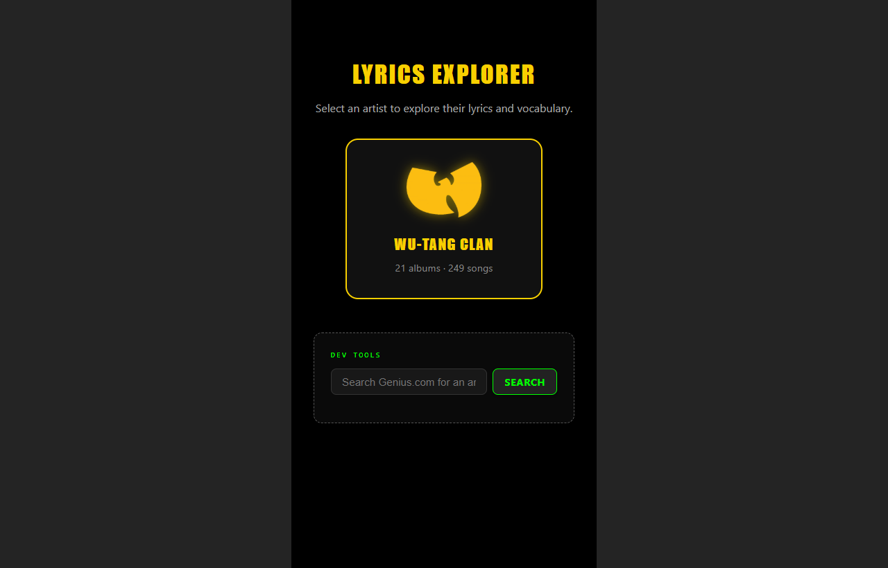
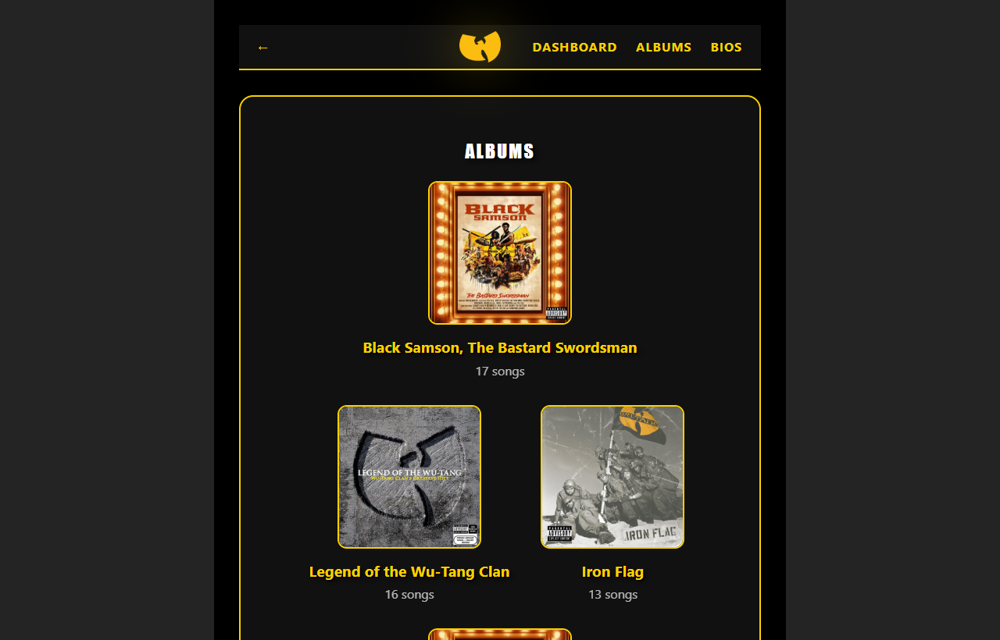
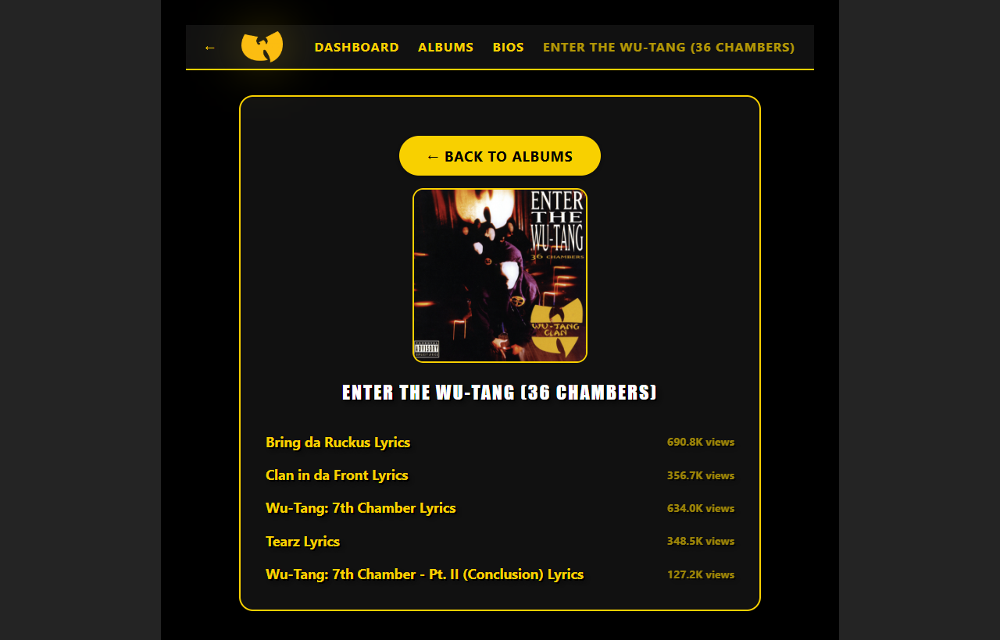
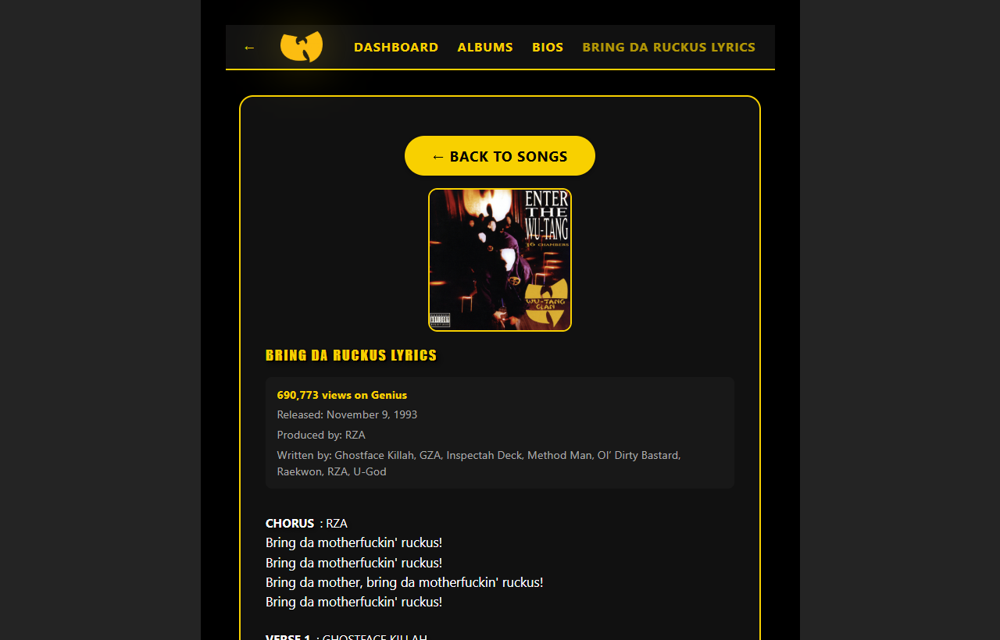
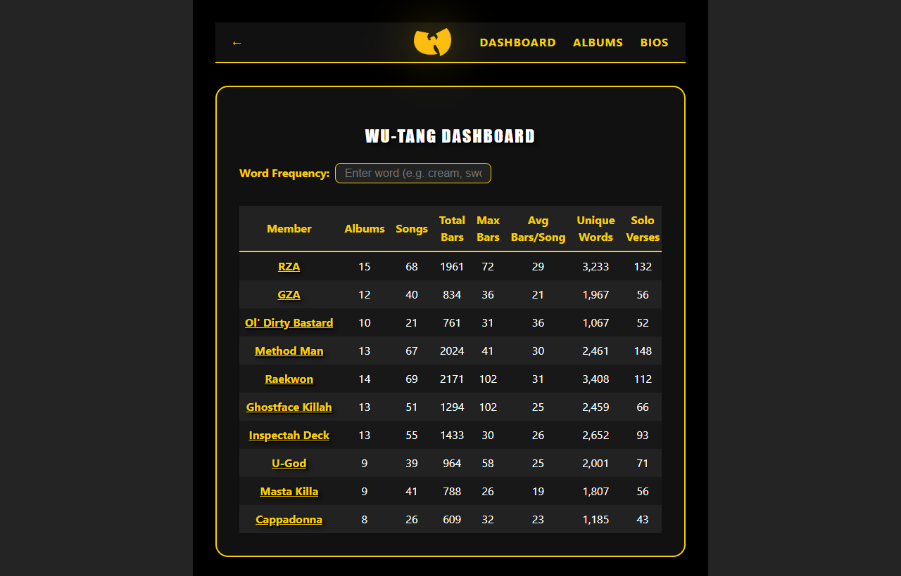
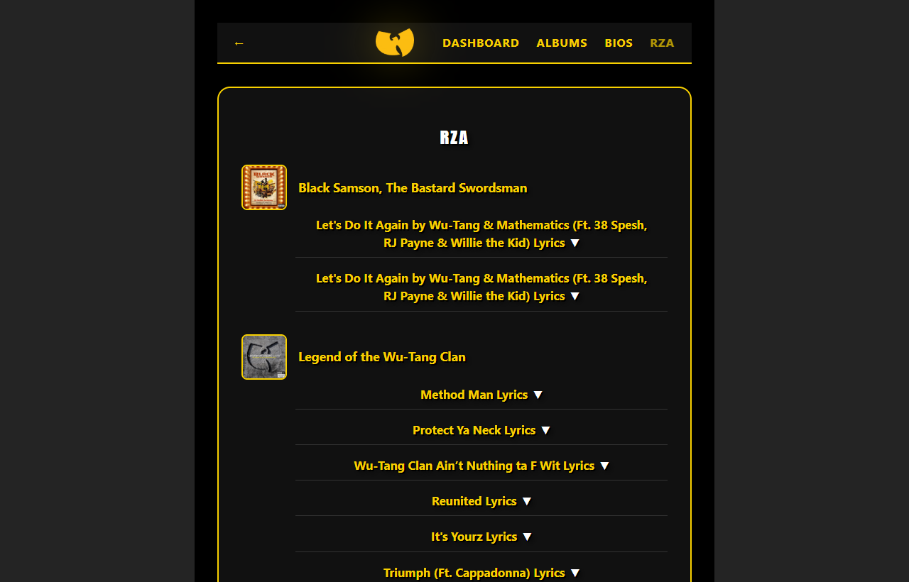
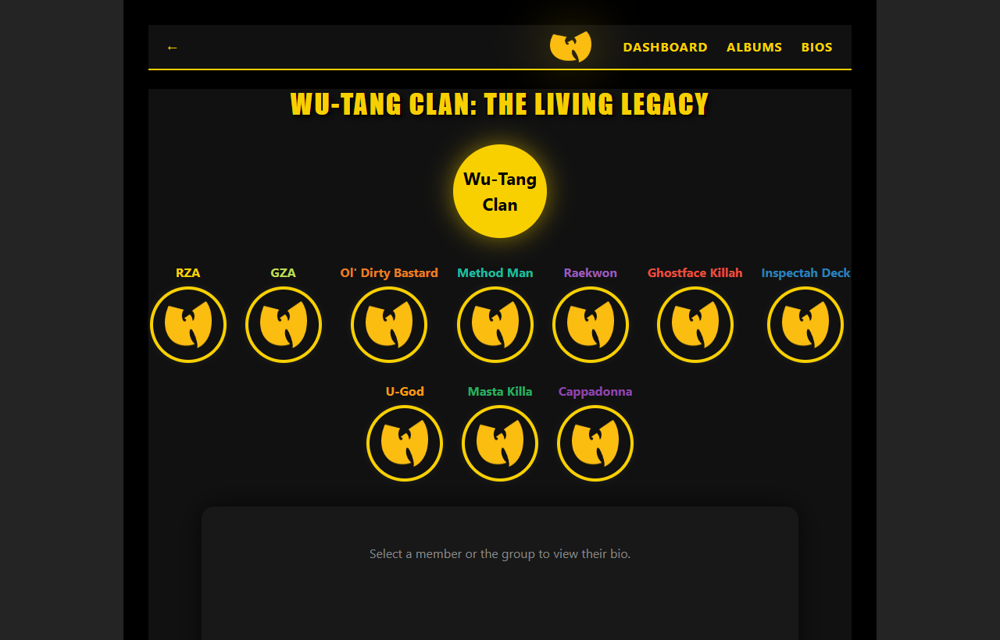

# Word Explorer

A multi-artist web app for scraping, browsing, and deep-diving into lyrics from Genius.com. Built with Vite + React. Deploys as a fully static site — no backend required.

Originally built around Wu-Tang Clan. Supports any artist or group with per-artist theming via JSON config.

**Live:** [wu-tang-wisdom.nooroticx.tv](https://wu-tang-wisdom.nooroticx.tv)



---

## Features

- **Single-artist hero landing** — when deployed with one artist, the landing page shows a full-screen welcome with the artist logo, name, and a styled "Enter" button; multi-artist deployments show a card grid
- **Scrape any artist** from Genius.com via CLI or in-browser dev tools
- **Browse albums and songs** with cover art, Genius view counts, release dates, and credits
- **Member dashboard** — per-member stats: song counts, total bars, max bars, avg bars/song, unique vocabulary, solo verses, and total Genius views
- **Live word frequency search** — add words and see per-member counts as columns; columns persist until removed
- **Member appearances** — click any member to see every verse they appear on, grouped by album
- **Bio page** — radial member tree with circle photos, individual bios (groups), or simple bio (solo artists)
- **Per-artist theming** — colors, fonts, and logos driven entirely by `config.json`
- **Dev tools** — search Genius.com, trigger scrapes, and edit member images directly from the browser in dev mode
- **70 unit tests** with Vitest covering scraper logic, utility functions, and theme functions

---

## Screenshots

### Albums


### Album Songs


### Song Lyrics


### Member Dashboard


### Member Appearances


### Bios


---

## Local Setup

### 1. Install dependencies

```bash
npm install
```

### 2. Configure Genius API credentials

The Genius API is required for metadata enrichment (pageviews, producers, writers, release dates) and member image fetching. Without it, the scraper still works but produces less complete data.

1. Create an account at [genius.com/api-clients](https://genius.com/api-clients)
2. Create a new API client — the redirect URL can be anything (e.g. `http://localhost`)
3. Copy `.env.example` to `.env` and fill in your credentials:

```bash
cp .env.example .env
```

```
GENIUS_CLIENT_ID=your_client_id_here
GENIUS_CLIENT_SECRET=your_client_secret_here
```

### 3. Start the dev server

```bash
npm run dev
```

Open [http://localhost:5173](http://localhost:5173). Dev mode enables additional tools not available in production: the DevToolbar on the landing page, and image edit buttons on the bio page.

---

## Admin Workflows

### Adding a New Artist

**Option A — CLI:**

```bash
# Basic scrape (lyrics only)
npm run scrape -- --artist "Kendrick Lamar" --slug Kendrick-lamar

# Scrape + enrich with API metadata in one pass
npm run scrape -- --artist "Kendrick Lamar" --slug Kendrick-lamar --enrich

# Large catalogs: scrape in chunks to avoid timeouts
npm run scrape -- --artist "Nas" --slug Nas --chunk-size 25 --offset 0
npm run scrape -- --artist "Nas" --slug Nas --chunk-size 25 --offset 25

# Enrich already-scraped data without re-scraping
npm run scrape -- --artist "Nas" --slug Nas --enrich-only
```

The scraper will:
- Fetch all albums and songs from Genius.com
- Parse lyrics into typed, artist-attributed verses
- Save to `public/data/artists/{slug}/lyrics.json`
- Auto-generate a `config.json` template (detects group vs solo by counting distinct verse credits)
- Update `public/data/manifest.json` so the artist appears on the landing page

**Option B — Dev Tools (in-browser):**

In dev mode, a **Dev Tools** panel appears at the bottom of the landing page. Search for an artist by name and click **Scrape** to add them without leaving the browser.

### Finding the Genius Slug

The slug is the artist's URL path on Genius.com. For `https://genius.com/artists/Wu-tang-clan`, the slug is `Wu-tang-clan` (case-sensitive).

---

### Enriching an Artist with API Metadata

Enrichment adds `pageviews`, `producers`, `writers`, `featuredArtists`, `releaseDate`, and `songArtUrl` to each song. Requires `.env` credentials.

```bash
# Enrich while scraping
npm run scrape -- --artist "Artist Name" --slug Artist-slug --enrich

# Enrich existing data only (no re-scrape)
npm run scrape -- --artist "Artist Name" --slug Artist-slug --enrich-only

# Wu-Tang shortcut
npm run enrich:wu-tang
```

---

### Adding Member Photos (Groups)

Member photos appear as circle thumbnails on the bio page. The enrich script fetches images from the Genius API and saves them **locally** to avoid CORS and availability issues.

**Step 1 — Run the image enrichment script:**

```bash
# One artist
npm run enrich:member-images -- wu-tang-clan

# All artists in manifest
npm run enrich:member-images
```

The script:
- Searches Genius for each member by name
- Collects multiple candidate image URLs (exact matches first, then partial)
- Tries each candidate in order — skips any that 404 or fail
- Downloads and saves the image locally to `public/data/artists/{slug}/members/{member-slug}.jpg`
- Stores the local path in `members/{member-slug}.json` — skips members that already have a local image

**Step 2 — Fix any that failed:**

Members where all candidates failed will log `[fail] ... use manual upload`. Fix them via the dev UI:

1. Start the dev server (`npm run dev`)
2. Navigate to an artist's **Bio** page
3. Hover over a member circle — a **✎** edit button appears (dev mode only)
4. Click it to open the image editor:
   - **Paste a URL** — the server downloads it locally automatically
   - **Choose local file** — upload directly from your computer

The image is saved to the same `members/` folder and the JSON is updated immediately. No restart needed.

---

### Customizing an Artist

Edit `public/data/artists/{slug}/config.json`:

```json
{
  "slug": "wu-tang-clan",
  "name": "Wu-Tang Clan",
  "type": "group",
  "geniusSlug": "Wu-tang-clan",
  "theme": {
    "primaryColor": "#F8D000",
    "primaryColorHover": "#fff200",
    "headerFont": "'Oswald', Impact, Arial Black, Arial, sans-serif",
    "logo": "/data/artists/wu-tang-clan/logo.png"
  },
  "members": [
    {
      "name": "RZA",
      "slug": "rza",
      "color": "#F8D000",
      "aliases": ["Bobby Digital", "Prince Rakeem"],
      "wiki": "https://en.wikipedia.org/wiki/RZA"
    }
  ],
  "tagline": "Wu-Tang is for the children.",
  "bioTitle": "The Wu-Tang Clan",
  "dashboardTitle": "Wu-Tang Dashboard",
  "disclaimer": "..."
}
```

Key fields:
- **`type`** — `"group"` shows member dashboard, bio tree, and appearances view; `"solo"` shows a simpler layout
- **`aliases`** — alternate stage names used in Genius credits (e.g. "ODB" → "Ol' Dirty Bastard"); critical for correct stat attribution
- **`color`** — each member gets their own accent color used in the bio circle border and appearances view

---

### Deploying a Specific Artist

By default `npm run build` includes all artists. To build a static site for one or more artists only:

```bash
# Single artist
npm run build:artists -- wu-tang-clan

# Multiple artists
npm run build:artists -- wu-tang-clan kendrick-lamar
```

This builds the full app to `dist/` then removes unselected artist directories and rewrites `manifest.json` to match. Upload the `dist/` folder to any static host.

### CI/CD — Auto-deploy on push

The repo includes a GitHub Actions workflow (`.github/workflows/`) configured for [IONOS Deploy Now](https://docs.ionos.space/docs/). Every push to `main` triggers an automated build and deployment — no manual uploads required.

**Workflow steps:**
1. `npm install` — install dependencies
2. `npm run build` — Vite production build
3. IONOS Deploy Now artifact action uploads `dist/` to the configured webspace

To use with your own IONOS account, add `IONOS_API_KEY` and `IONOS_SSH_KEY` as GitHub repository secrets and update the `project-id` in the orchestration workflow.

---

## Project Structure

```
public/data/
  manifest.json                   # All available artists (landing page)
  artists/{slug}/
    config.json                   # Theme, members, aliases
    lyrics.json                   # Scraped lyrics + metadata
    logo.png                      # Artist logo (optional)
    members/
      {member-slug}.json          # Member bio, facts, image path
      {member-slug}.jpg           # Downloaded member photo (local)

src/
  components/                     # React UI
    LandingPage.jsx               # Artist card grid + About modal
    ArtistView.jsx                # Albums, dashboard, appearances views
    ArtistBio.jsx                 # Bio page with circle photos + dev edit
    DevToolbar.jsx                # Dev-only scrape/search panel
  hooks/
    useArtistData.js              # Fetches config + lyrics in parallel
    useTheme.js                   # applyTheme / resetTheme (CSS vars)
    useHashRouter.js              # Hash-based deep linking
  utils/
    artistUtils.js                # matchMember, formatViews, getDashboardStats

scrape-lyrics.js                  # Genius.com scraper (CLI)
vite-plugin-dev-api.js            # Dev-only API middleware
scripts/
  enrich-member-images.js         # Download member photos from Genius
  build-artists.js                # Selective artist production build
```

---

## All Commands

| Command | Description |
|---------|-------------|
| `npm run dev` | Start dev server at localhost:5173 |
| `npm run build` | Production build to `dist/` (all artists) |
| `npm run build:artists -- {slug}` | Production build for specific artist(s) only |
| `npm run preview` | Serve production build locally |
| `npm test` | Run unit tests (Vitest, 70 tests) |
| `npm run test:watch` | Run tests in watch mode |
| `npm run lint` | ESLint |
| `npm run scrape -- --artist "..." --slug ...` | Scrape an artist |
| `npm run scrape -- ... --enrich` | Scrape + enrich with API metadata |
| `npm run scrape -- ... --enrich-only` | Enrich existing data only |
| `npm run scrape:wu-tang` | Scrape Wu-Tang Clan |
| `npm run enrich:wu-tang` | Re-enrich Wu-Tang with latest API metadata |
| `npm run enrich:member-images -- {slug}` | Download member photos locally |

---

## License

MIT
